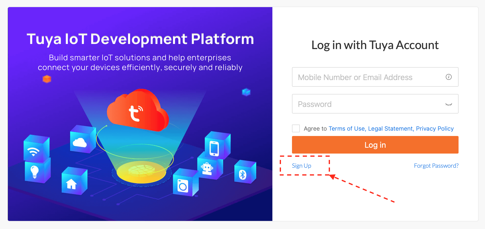
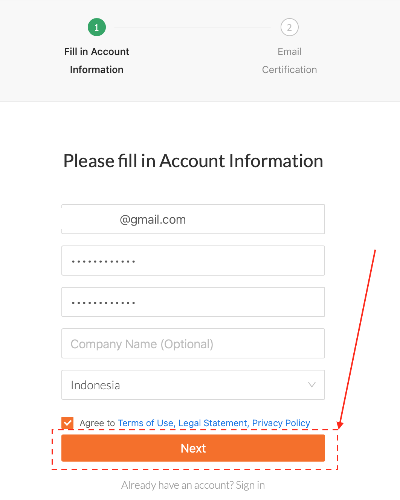
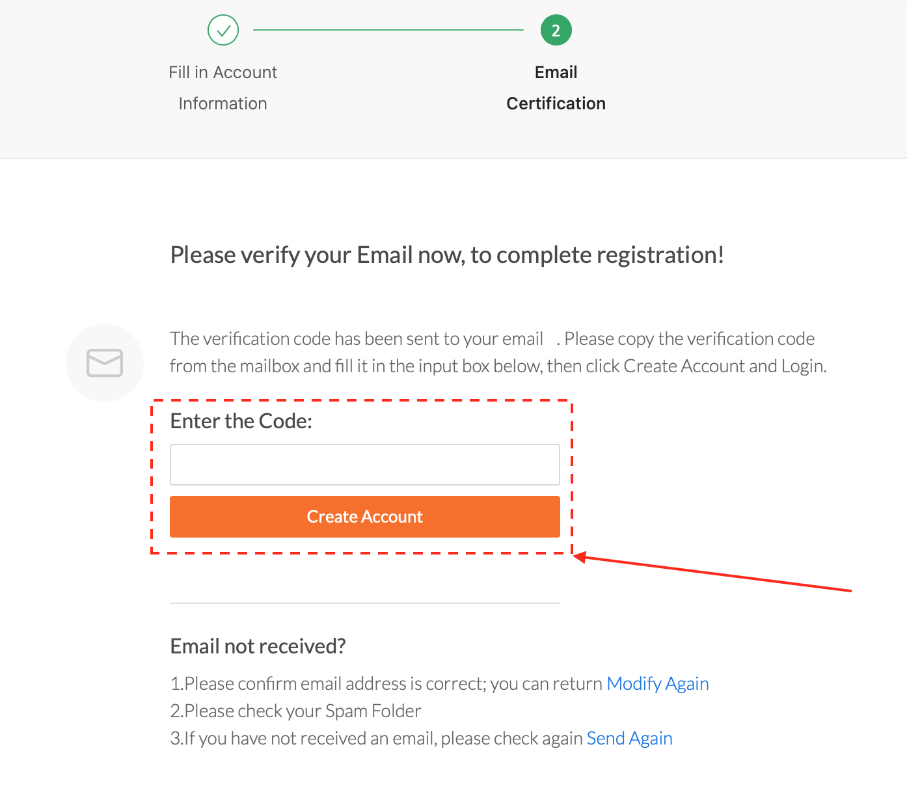

##This document will guide you through create, prepare your Tuya IoT Account and link your account to the IoT Device (in this tutorial we are using BARDI Smart Plug)
---

To Do List: 
- [ ] Account creation (sign up for first time user)
- [ ] Create Web Cloud Development 
- [ ] Link Device 
- [ ] Test/device debugging

---
# Account Creation
For a first time user, you need to create account using this step. Otherwise, you can just [login](https://iot.tuya.com) into your Tuya IoT Platform account and skip this step. 
1. Open [Tuya IoT Platform](https://iot.tuya.com) and click on **signup** button.

2. Fill in the Account Form and then click on **next** button. You may need to complete the captcha puzzle to get through the next step.

3. Enter the verification code sent to your email and fill it on the box, then click on **Create Account**. Then your Account is succesfully created. 

---
# Create Web Cloud Development (WIP)